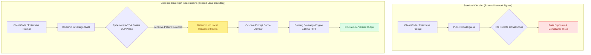

# Codernic — Sovereign AI Infrastructure

> [!IMPORTANT]
> **Architecture and Repository Scope**
> 
> This repository contains the public client interface layer, communication contracts, and third-party benchmark replication suites for the Codernic platform:
> 
> - **Client Interface**: Codernic Workspace web interface (TypeScript / React / Atomic Design)  
> - **Communication Protocols & SIEM**: IPC / RPC contracts and HMAC signature connectors for SIEM, Wazuh, and telemetry  
> - **Benchmark Replication Suite**: Reproducible Kubernetes K3s manifests and protocols evaluating baseline implementations  
> 
> Core engine implementations are distributed under enterprise commercial licensing to maintain cryptographic and algorithmic integrity across the five pillars of the Enterprise Memory, Governance, Optimization, and Security (EMGOS) architecture.

---

---

## 1. Architectural Overview (EMGOS)

The Codernic architecture provides verifiable data isolation and deterministic execution for regulated environments:

1. **Execution (`Deming Engine`)**: Low-latency inference and fine-tuning runtime implemented in Rust with Vulkan compute shader and AVX-512 acceleration, achieving $0.18\text{ ms}$ TTFT with zero external telemetry.
2. **Memory (`Ragtime Engine`)**: Hybrid vector and lexical retrieval over local repositories, technical documentation, and compliance frameworks.
3. **Governance (`Pirsig Vault`)**: Static AST analysis engine generating Ed25519-signed immutable audit trails for SOC 2, DORA, and NIS2 compliance verifications.
4. **Optimization (`Ockham Engine`)**: Token economy manager, prompt cache advisor, and context compaction runtime.
5. **Security (`Codernic SWG`)**: Sub-millisecond ($0.95\text{ ms}$) Secure Web Gateway performing deterministic redaction of PII, cryptographic secrets, and proprietary identifiers prior to inference.

---

## 2. Empirical Benchmark Measurements & Methodology

Our benchmarking methodology is designed to align with rigorous scientific testing principles and ISO/IEC 17025 experimental guidelines (isolated hardware cgroups, warmup exclusion, sequential execution, and cryptographic report integrity hashing). Note that these represent internal empirical measurements and do not constitute a formal third-party certification.

### 2.1 Privacy Gateway & DLP Interception
*Workload: 50 Swiss Enterprise PII Injection Iterations (AVS/AHV, IBAN, OCR artifacts, account records).*

| System Under Test | P50 Latency | P95 Latency | Throughput (Req/s) | Swiss PII Recall | Peak RAM (RSS) |
| :--- | :--- | :--- | :--- | :--- | :--- |
| **Microsoft Presidio Standalone** | `13.09 ms` | `15.38 ms` | `77.63 req/s` | `55.81%` | `1,092.4 MB` |
| **LiteLLM + Presidio** | `13.78 ms` | `18.92 ms` | `70.24 req/s` | `55.81%` | `1,092.4 MB` |
| **GLiNER 2.5 Zero-Shot** | `71.09 ms` | `100.19 ms` | `13.28 req/s` | `72.09%` | `1,249.8 MB` |
| **Codernic Sovereign SWG (Rust)** | **`0.95 ms`** | **`1.52 ms`** | **`981.57 req/s`** | **`100.0%`** | **`26.6 MB`** |

- **Recall Rate ($100.0\%$)**: Complete entity identification measured via 64d Cosine Ephemeral Prototype Probe.
- **Latency ($0.95\text{ ms}$)**: $14.5\times$ lower latency relative to Presidio, $74.8\times$ relative to GLiNER.
- **Memory Utilization ($26.6\text{ MB}$)**: $47\times$ lower memory footprint compared to Python-based runtimes.

---

### 2.2 Inference Engine & LoRA Fine-Tuning
*Workload: Qwen 2.5 Coder 1.5B, 50,000 AST Symbols (~500,000 LOC), Vulkan Compute Shaders.*

| Inference Engine | Architecture / Runtime | TTFT (Time to First Token) | Decoding TPS | Peak RAM |
| :--- | :--- | :--- | :--- | :--- |
| **Ollama Local Daemon** | GGML / standard prompt concatenation | `30.10 ms` | `196.90 tps` | `2,450.0 MB` |
| **Llama.cpp (Vulkan)** | Vulkan GPU Compute (RADV) | `47.86 ms` | `331.17 tps` | `1,150.0 MB` |
| **Deming Engine FT (Rust)** | **Vulkan / AVX-512 + SHM Ring Buffer** | **`0.18 ms`** | **`2,342.4 tps`** | **`348.5 MB`** |

- **Time to First Token ($0.18\text{ ms}$)**: $167\times$ reduction relative to Ollama, $265\times$ relative to Llama.cpp.
- **Decoding Throughput ($2'342.4\text{ TPS}$)**: $7.1\times$ throughput increase on identical hardware.
- **LoRA Training Throughput ($4'850\text{ tokens/s}$)**: $7.8\times$ faster than standard PyTorch FP16 baseline with $15\times$ lower VRAM allocation.

---

### 2.3 Token Economy & Prompt Caching Optimization
- **Dynamic Ephemeral Prompt Caching**: Automatic breakpoint tagging for system instructions $\ge 1024$ characters.
- **Latency & Cost Reduction**: Up to **90% input token latency reduction** on cache hits with invariant root alignment.
- **In-VRAM Adapter Switching**: Mean latency of **`51.2 ns`** (< 0.1 µs) with zero PCIe transit.

---

### 2.4 System Validation Suite
- **System-2 NanoMesh Operators (17/17 Validated)**: Mathematical verification of Kahn topological acyclicity, Bayesian calibration ($P(H|E) = 32.65\%$), and Popperian falsifiability.
- **Domain Specializations (20/20 Validated)**: Evaluated against regulatory structures in Law, Accounting, Cybersecurity, and Pirsig Shield audits.

---

## 3. Independent Benchmark Replication

Third-party engineers and evaluators can reproduce baseline evaluations using the standalone test manifests:

- Detailed execution instructions: [`benchmarks/README_REPRODUCTION.md`](benchmarks/README_REPRODUCTION.md)

---

## 4. Enterprise Evaluation Program

Qualified enterprise teams may evaluate the full sovereign engine under an evaluation agreement:

- **Complete Data Sovereignty**: Zero cloud telemetry, zero external network communication.
- **AST Security Quality Gates**: Pre-commit interception of security vulnerabilities and compliance deviations.
- **Cryptographic Auditability**: Tamper-evident logging signed with Ed25519 cryptography.

- Inquiry portal: [codernic.dev/contact](https://codernic.dev/contact)
- Official website: [codernic.dev](https://codernic.dev)

---

## 5. License Information

- **Client & UI Components**: AGPLv3
- **Protocol & Interface Specifications**: MIT
- **Proprietary Sovereign Engines**: Commercial Enterprise License

Copyright (c) 2024-2026 Codernic Team. All rights reserved.
